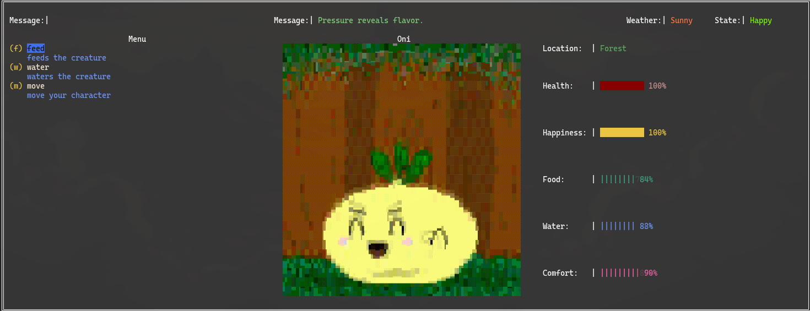

# 🐣 Pocket Oni – Terminal Tamagotchi

A simple, terminal-based virtual pet inspired by classic Tamagotchi games.  
Take care of your creature by feeding it, and keeping its stats balanced.  


Watch your pet's **Happiness**, **Hunger**, **Water**, and **Comfort** as they change over time, and make sure it stays healthy!

---

## 🖥️ Features

- Terminal-based interface (no GUI required)  
- Manage your pet's stats in real-time  
- Perform actions like feed, water, clean.
- No persistent state, the stakes are real.

---

## Motivation

I was curious how some developers build lively, interactive applications entirely inside the terminal. This project became my way of understanding how terminal rendering really works — how the screen refreshes, how views update, and how content is drawn in a character-cell environment.

Along the way, I explored how to display structured UI elements, render simple animations, and organize a terminal application properly.

I didn’t want to build another RSS aggregator or Pokémon API tool. Instead, I created Pocket Oni — my own little virtual pet that lives entirely in the terminal.

## 🛠️ Quick Start

### Requirements

- Go 1.20+  
- Terminal that supports ANSI characters  

### Clone

```bash
git clone https://github.com/Darkpowercross/pocket-oni.git
```

### Run

```bash
cd pocket-oni
go run .
```

Build Executable

``` bash
go build -o pocket-oni ./cmd
./pocket-oni
```

## Usage



## Contributing

### Submit a pull request

If you'd like to contribute, please fork the repository and open a pull request to the `main` branch.